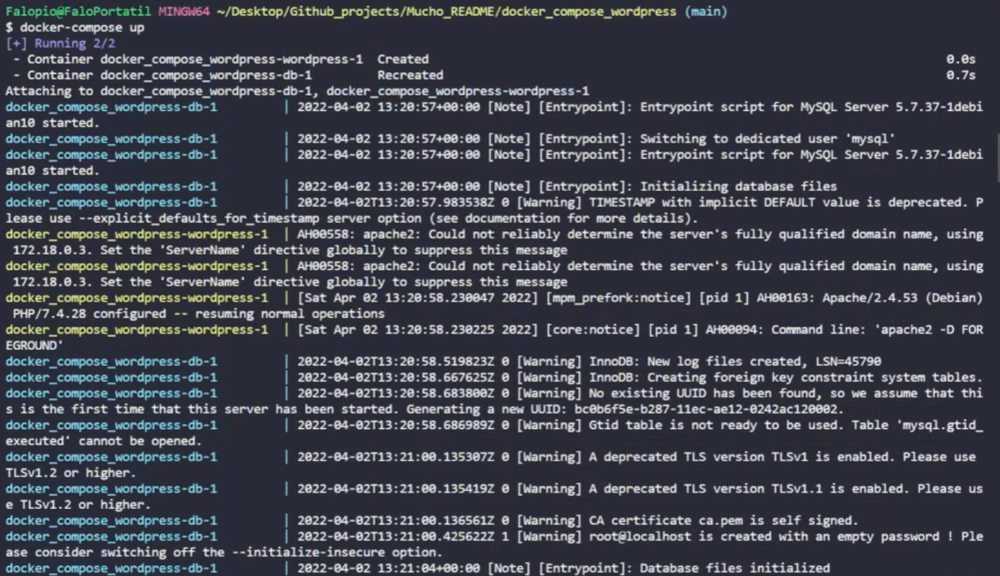
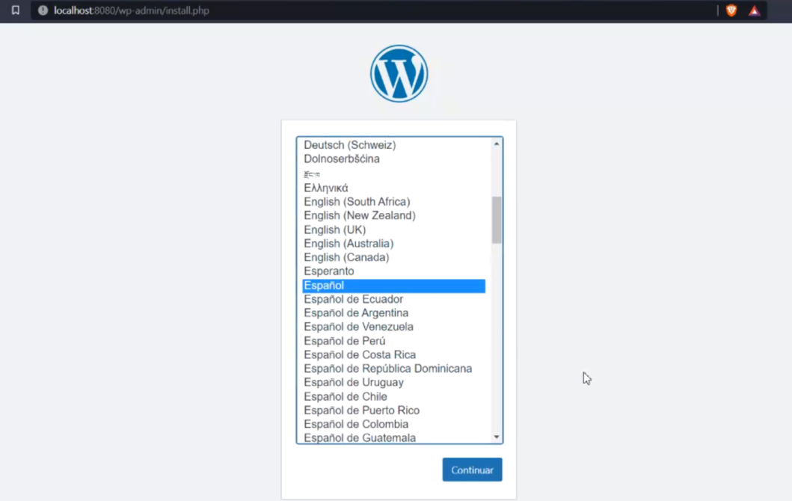

# Enunciado

Siguiendo el videotutorial propuesto de un creador de contenido de habla hispana,que se está especializando en Docker, utilizando docker compose deberéis gestionar una configuración de wordpress y mysql. Para empezar debemos saber que con docker compose podemos manejar fácilmente las configuraciones de varios contenedores.

# Solucion

En Docker desktop ya viene incluido el docker-compose.

## File Docker-compose

Vamos a crear el archivo `docker-compose.yaml` con el siguiente codigo:

```docker-compose
version: '3.1'

services:

  wordpress:
    image: wordpress
    ports:
      - 8080:80
    environment:
      WORDPRESS_DB_HOST: db
      WORDPRESS_DB_USER: erik
      WORDPRESS_DB_PASSWORD: 12345678
      WORDPRESS_DB_NAME: sistemas

  db:
    image: mysql:5.7
    environment:
      MYSQL_DATABASE: sistemas
      MYSQL_USER: erik
      MYSQL_PASSWORD: 12345678
      MYSQL_RANDOM_ROOT_PASSWORD: '1'
```

Si le interesa la explicacion del codigo, esta comentado en el file del repositorio.

## Correr el Docker-compose

Para lanzar el docker comose nos tenemos que hubicar donde este el file y lanzamos:

```bash
$ docker-compose up
```

Despues de eso se descargaran las imagenes en el caso de que no esten.



### Comprobar que funciona

Como hemos definido el puerto donde va a correr la instalacion del wordpress en el docher compose, en este caso hemos seleccionado 8080:80. Vamos al navegador y entramos en el localhost para comprobar que funciona.


