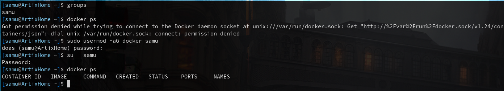
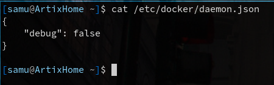

# Docker Seguridad

## Enunciado

Siguiendo el manual propuesto completa el ejercicio de seguridad en Docker.

---

## Solucion

comenzamos abriendo la consola

Miramos los usuarion en el grupo usando

```bash
$ groups
```

Comprobamos que no tenemos permisos

```bash
$ docker ps
```

Ascendemos el usuario para que pueda acceder como usermod:

```bash
$ sudo usermod -aG docker samu
```

Comprobamos que podemos acceder ahora:

```bash
$ docker ps
```



### json daemon

Ahora crearemos un json en modo debug false de la siguiente manera.

Como somos Linux enjoyers y nos flipa la consola y esas cosas de Linux usamos el siguiente comando:

```bash
$ cat /etc/docker/daemon.json
```

enter y en el file escribimos

```JSON
{
    "debug":false
}
```


