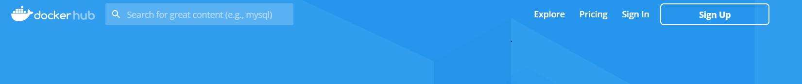
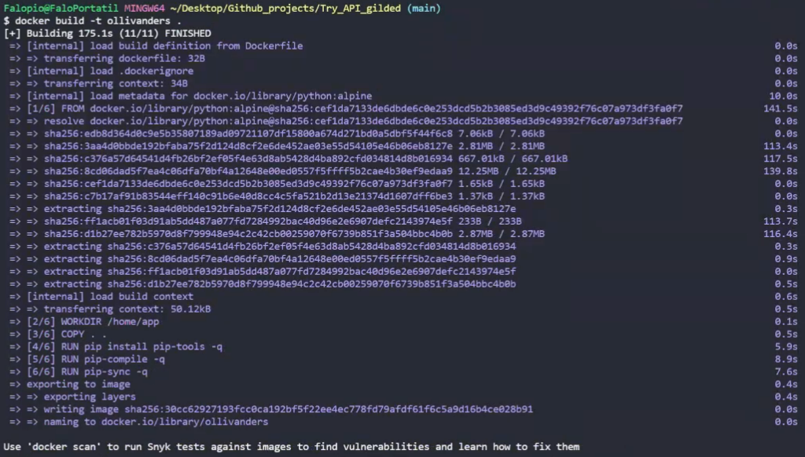
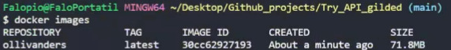
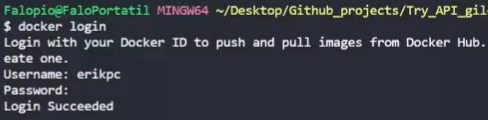
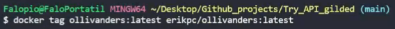
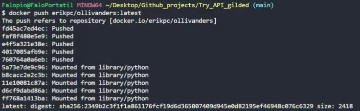
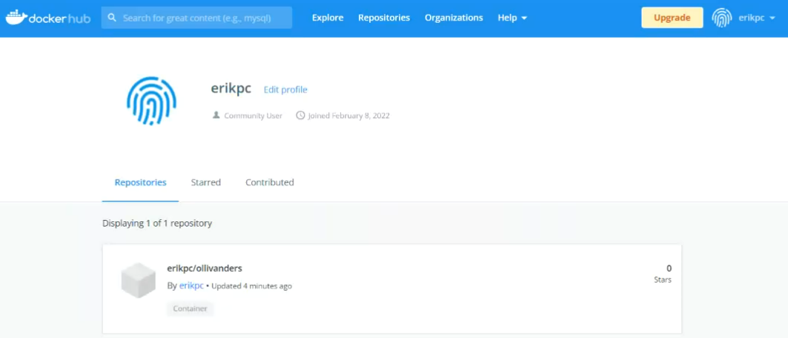
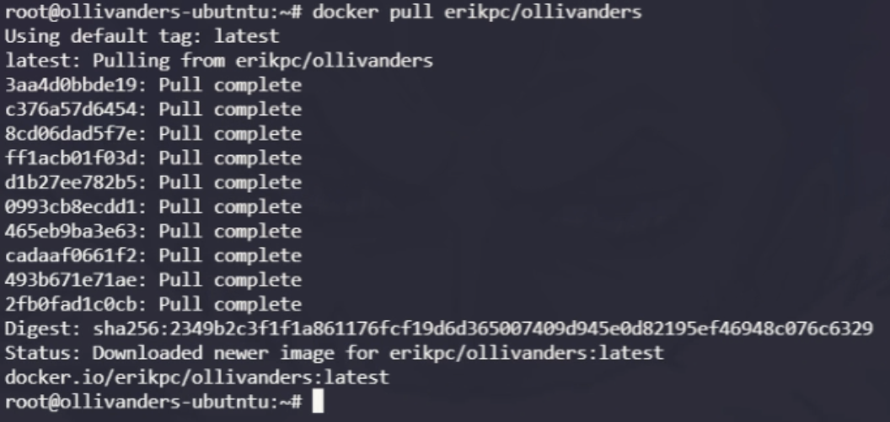
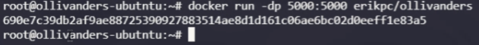
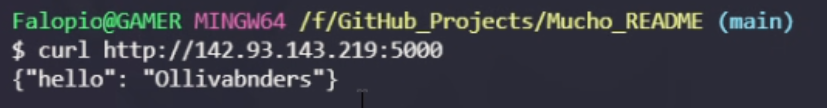

# Enunciado

Partiendo de la guía adjunta adjunta y realizando la gestión de dependencias del proyecto en el Dockerfile, tal y como habéis anteriormente, se trata de crear una imagen personalizada con Flask y Mongo Atlas en Docker. Tened en cuenta que tenéis una nota, creada por David, de Slack con los recursos necesarios para realizar la actividad.

Deberéis realizar todo el proceso de investigación, implementación y documentación.

La entrega será mediante un repositorio adjunto a esta tarea en la que, tal y como hemos hecho otras veces, podamos revisar el resultado.

Opcionalmente podéis subir la imagen a docker hub. Finalmente, y también de manera opcional, podéis publicar la API REST siguiendo la filosofía en la parte B de la tarea anterior de NGINX.

# Solucion

## Dockerfile

He añadido el dockerfile para dockerizar la api y el .gitignore. En este repo no funcionara, para que funcione tienes que ir al repositorio de la [API](https://github.com/ErikPC/API_Gilded_Ollivanders)

```DockerFile
FROM python:alpine

WORKDIR /home/app

COPY . .

RUN pip install pip-tools -q
RUN pip-compile -q
RUN pip-sync -q

CMD ["python","-m","flask","run","-h","0.0.0.0"]
```

## Subir imagen a Dockerhub

Vamos a la pagina oficial de [Dockerhub](https://hub.docker.com/) e iniciamos sesion.
Seleccionamos "Sign in" en el caso de que tengamos cuenta y si no "Sign up" y seguimos los pasos.
Como yo ya tenia la cuenta inicio sesion.



Ahora vamos a preparar la imagen para subirla a nuestro perfil de Dockerhub. Asi que tendremos que usar el siguiente comando:

```bash
$ docker build -t ollivanders .
```



Ahora podemos ver la imagen que hemos creado usando:

```bash
$ docker images
```



En nuestro caso "ollivanders:latest"

Ahora nos logeamos usando:

```bash
$ docker login
```



Le cambiamos el nombre con la convencion de Docker("nombre de cuenta / "nombre imagen") con:

```bash
$ docker tag ollivanders:latest erikpc/ollivanders:latest
```



Subimos la imagen a nuestro perfil relaizando el siguente comando:

```bash
$ docker push erikpc/ollivanders:latest
```



Ahora confirmamos en nuestro perfil de Dockerhub que la imagen esta subida



## Lanzar API en DigitalOcean

A continuacion voy a poner los pasos que hay que seguir para lanzar nuestra imagen de Dockerhub en un VPS. Partiremos de que docker ya esta instalado en la VPS , si necesitas ayuda para ello sigue esta [guía](https://docs.docker.com/engine/install/ubuntu/), esta preparada para instalarse en un Ubuntu.

Para empezar nos tendremos que descargar la imagen usando nuestro gran amigo:

```bash
$ docker pull erikpc/ollivanders
```



Continuaremos lanzando nuestra imagen en el puerto 5000.

```bash
$ docker run -dp 5000:5000 erikpc/ollivanders
```



Nuestra imagen ya esta siendo lanzada en el servidor , asi que vamos a probar con el comando curl a ver. Tener en cuenta que se usa la ip de la VPS.

```bash
$ curl http://142.93.143.216:500
```


