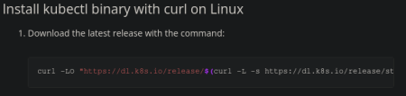
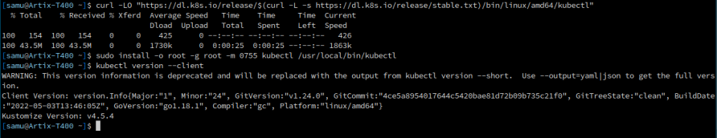
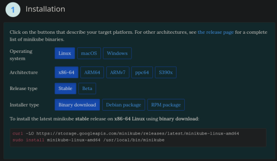
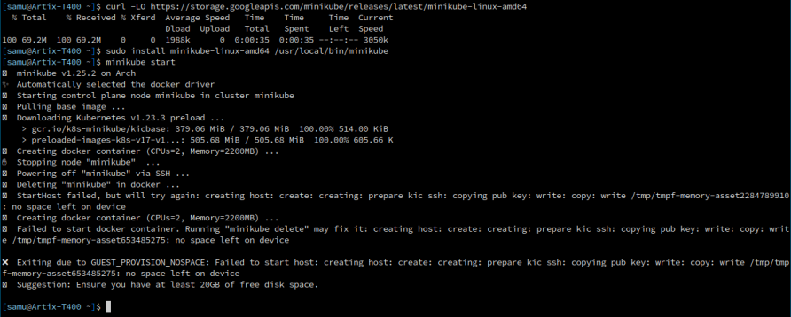

# Instalación de Minicube y Kubectl

### Practica realizada por:
Samuele Tonarini  
Erik Pardillo  

## Kubectl
Vamos a la pagina oficial y seguimos los pasos para nuestro OS  
  

Siguendo los pasos para linux deberia ser algo de este estilo: 
```sh
$ curl -LO "https://dl.k8s.io/release/$(curl -L -s https://dl.k8s.io/release/stable.txt)/bin/linux/amd64/kubectl"

$ sudo install -o root -g root -m 0755 kubectl /usr/local/bin/kubectl

$ kubectl --version
```
  

## Minicube
Luego vamos a la pagina oficial de minicube y otra vez seguimos los pasos para nuestro OS  
  

Los pasos para linux deberian paracerce a estos:  
```sh
$ curl -LO https://storage.googleapis.com/minikube/releases/latest/minikube-linux-amd64

$ sudo install minikube-linux-amd64 /usr/local/bin/minikube

$ minikube start
```
  
*En este caso da error por falta de espacio.*
